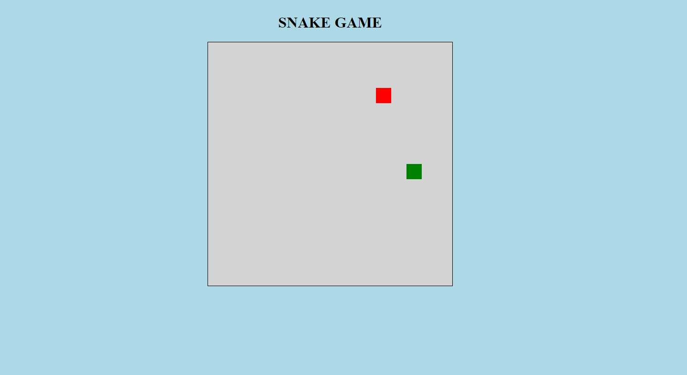

# Snake Game

A classic arcade game where the player controls a snake that grows in length as it eats food, while avoiding obstacles and its own body.

## Description

This is a web-based game built using HTML, CSS, and JavaScript, and it's a modern take on the classic Snake Game. In this version of the game, the player controls a snake that moves around the game board to eat food and grow in length, while avoiding obstacles such as walls and the snake's own body. The game gets progressively more difficult as the snake grows longer, and the player must be strategic to avoid collisions and score as many points as possible.

## Features

- Responsive design for seamless gameplay on desktop and mobile devices
- Colorful and engaging visuals
- Multiple levels of difficulty to challenge players of all skill levels
- Dynamic score tracking and high-score display

## Technologies Used

- HTML
- CSS
- JavaScript

## Usage

To play the game, simply clone this repository and open the `index.html` file in your preferred web browser. The game will load automatically and you can start playing immediately.

Alternatively, you can play the game live by visiting [Burntroll](https://github.com/Burntroll/Snake-Game).

## Contributing

Contributions to this project are welcome! Feel free to fork this repository and submit a pull request with your changes.

## Credits

This project was built by [Francisco Silva](https://github.com/Burntroll).

## License

This project is licensed under the [MIT License](https://opensource.org/licenses/MIT).

## Results

